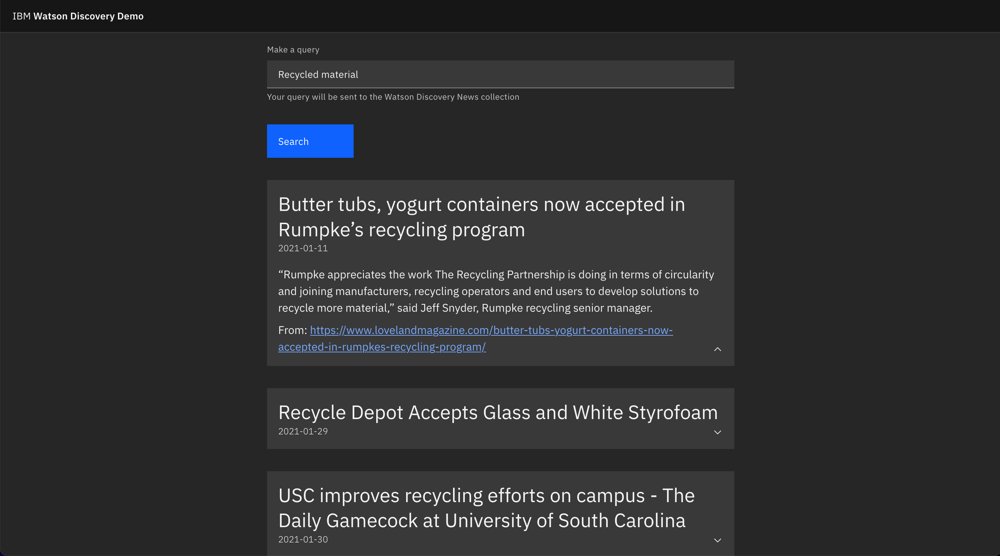
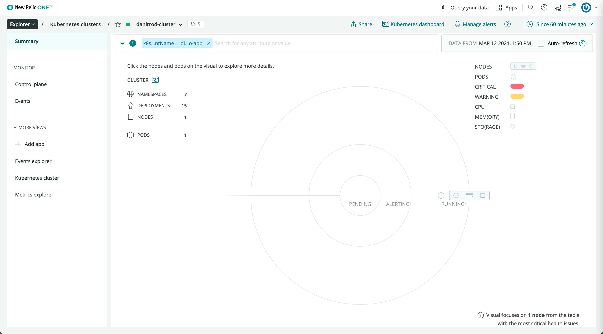
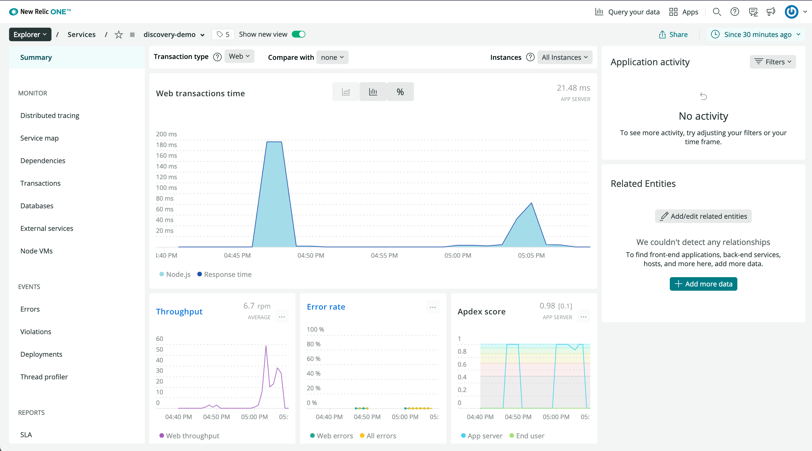

# Deploy a web application on IBM Kubernetes Service

## Introduction

In this lab, we will deploy a simple app, that serves a Single Page Application (SPA) and communicates with Watson Discovery, on Kubernetes. The [SPA](./react-app) will be served by a Node.js back end running [Fastify](https://fastify.io). The [back end](./server) will then make queries to Watson Discovery and return the results. Finally, we will setup our cluster for Full Stack Observability with New Relic to easily make sure everything is running ok in our cluster and analyze some metrics, logging and more.

## Prerequisites

- Any non-lite type of [IBM Cloud](https://cloud.ibm.com/registration) account (you must upgrade to create a free Kubernetes cluster)
- [Docker](https://www.docker.com/)
- [IBM Cloud CLI](https://github.com/IBM-Cloud/ibm-cloud-cli-release#downloads)
- [Kubectl](https://v1-18.docs.kubernetes.io/docs/tasks/tools/install-kubectl/)

## Setup

Before we start, install the following IBM Cloud CLI plugins:

```
ibmcloud plugin install kubernetes-service
ibmcloud plugin install container-registry
```

Create a free 1 worker [IBM Kubernetes Service](https://cloud.ibm.com/kubernetes/catalog/create) cluster.

And finally, create a free [Watson Discovery](https://cloud.ibm.com/catalog/services/watson-discovery) instance.

## Step-by-step

This step-by-step guide assumes a Linux/Unix like shell usage. Slight adaptations might be necessary for different CLI shells.

### Step 1

Start by logging in to IBM Cloud:

```sh
ibmcloud login
```

### Step 2

Login to IBM Container Registry as well:

```sh
ibmcloud cr login
```

### Step 3

Add a namespace for your project at IBM Container Registry (ICR):

```sh
export ICR_NAMESPACE=<your_namespace>

ibmcloud cr namespace-add $ICR_NAMESPACE
```

### Step 4

Let's build the app. Build a Docker image for the app, tag and push it to ICR under your namespace:

```sh
export APP_IMAGENAME=us.icr.io/$ICR_NAMESPACE/discovery-demo-app:v1
docker build -t $APP_IMAGENAME .
docker push $APP_IMAGENAME
```

(building the image should take a few minutes)

### Step 5

Connect to your IBM Kubernetes Service (IKS) cluster:

```sh
ibmcloud ks cluster config --cluster <your_cluster_name>
```

The cluster name is the one you chose when creating it. In case you forgot, you can check that in the [IBM Cloud resource list](https://cloud.ibm.com/resources), under `Clusters`.

### Step 6

For our back end to make requests to Watson Discovery, it will need the Discovery instance credentials, which will be defined by two environment variables. We will create the credentials as a Kubernetes secret, then inject them in the app by configuring environment variables on the [deployment yaml file](./server/deployment.yaml). You can find your `APIKEY` and `URL` for Watson Discovery by going to your [IBM Cloud resource list](https://cloud.ibm.com/resources), and clicking on your Watson Discovery instance under `Services`. Store them in environment variables as below and create the secret:

```sh
export DISCOVERY_APIKEY=<discovery_apikey>
export DISCOVERY_URL=<discovery_url>

kubectl create secret generic discovery-credentials --from-literal=api-key=$DISCOVERY_APIKEY --from-literal=url=$DISCOVERY_URL
```

### Step 7

Now we will deploy our built image to Kubernetes. First, update the [deployment.yaml](./server/deployment.yaml) file to match your image name. You should update the line 24's image value - updating just the namespace will do just fine. **This is important!** Not changing the image name will cause your pod to not find any images. After doing that, we can deploy:

```sh
kubectl apply -f server/deployment.yaml
```

_In case you're wondering, the `deployment.yaml` file can be generated with `kubectl create deployment <deployment_name> --image=<image_name> --port <port> --dry-run=client -o yaml > deployment.yaml`. The yaml file we used is just additionally configured to use the secret as environment variables._

### Step 8

Our app should now be running. You can check that with `kubectl get pods`. If there are any errors, you can check the logs with `kubectl logs <pod_id>`. The next step is to expose our app publicly, so we can access it. Let's do that:

```sh
kubectl expose deploy discovery-demo-app --type=NodePort
```

A Node Port will be created and it will forward the pod's exposed port to the node's public interface

### Step 9

Ok! Now your app is ready to be publicly accessed! We will do that by getting the cluster worker node's public IP and accessing the port forwarded by the Node Port. First, run:

```sh
kubectl get svc
```

You should see the discovery-demo-app `NodePort` and some columns of information. With a free cluster, you can't have an external IP for your service yet, but you can access the service through the worker node's public IP. You can find the TCP port forwarded by the Node Port in the above command's output. It should look something like `8080:<port>/TCP`, being a port in the range `30000 - 32767`.

Take note of the port. You will use it to access the app.

### Step 10

Get your worker node's public IP. You can do that by running the following command:

```sh
ibmcloud ks worker ls -c <your_cluster_name> # Cluster name is same as in step 5
```

That will output the ID of the worker in your cluster, together with its public and private IPs. Copy the public IP as we will use it next.

### Step 11

Access the app! The URL should be formatted like this: `http://<worker_ip>:<node_port>`. You can access it directly from your browser and see the magic happen. Try out a couple of queries for Watson Discovery news!



### Step 12

Congratulations, you now have an app running! We want to make sure it keeps running smoothly, so let's set up Observability with New Relic.

First [register for a free New Relic account](https://newrelic.com/signup?utm_source=callforcode2021)

Then [log in to your New Relic account](https://one.newrelic.com/) and follow the guided install for Kubernetes. During the guided install you will have to:

1. Give your cluster a meaningful name
1. Accept all setup options
1. Choose `Manifest`
1. Download the manifest file
1. Apply the manifest file with `kubectl apply -f <PATH_TO_DOWNLOADED_FILE> -n default`
1. You can first do the next step before going into the Kubernetes Cluster Explorer

We also want detailed application monitoring, and to get that, we only need to update the `server/deployment.yaml` file and uncomment the `NEW_RELIC_LICENSE_KEY` and `NEW_RELIC_APP_NAME` environment variable definitions.

Now redeploy our app:

```sh
kubectl apply -f server/deployment.yaml
```

_The Node.js app is already instrumented with New Relic:_

- _The New Relic library was imported with a `require('newrelic');` in the main module (`src/index.ts`)_
- _The `package.json` file includes `newrelic` as a dependency_

Now navigate to the New Relic Kubernetes Cluster Explorer and see what's happening in your cluster.

If you filter by the `discovery-demo-app` deployment, you can see the status of the running pod (click on the pod to see its status):



You can also see the response times for your service, do that by going to `Explorer > APM` and searching for `discovery-demo`.



Much more can be done within New Relic One. If you want to learn more about the Kubernetes Cluster Explorer, watch [this video](https://www.youtube.com/watch?v=RKaEt26HjhI&ab_channel=NewRelic).
